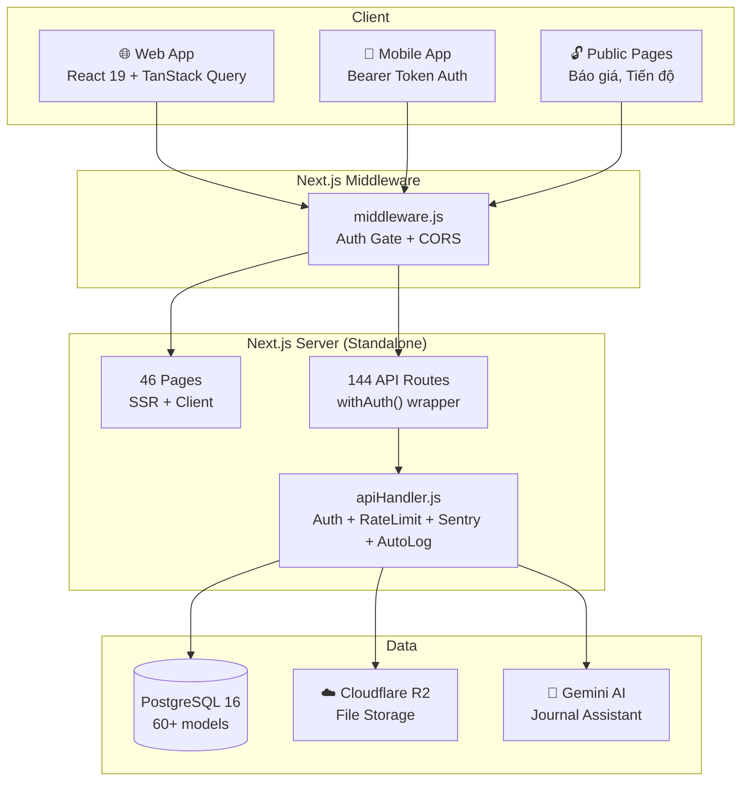
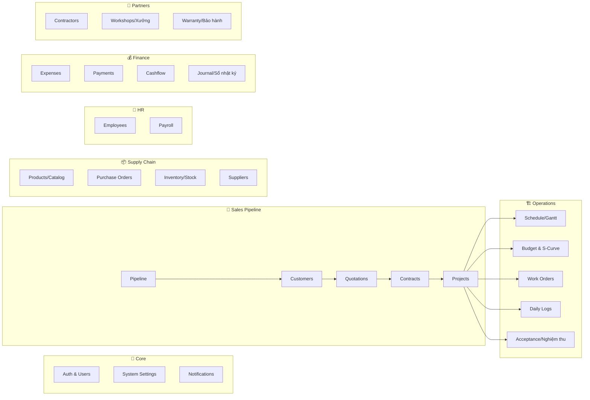

# ARCHITECTURE.md — MỘT NHÀ ERP

> Hệ thống quản lý doanh nghiệp nội thất/xây dựng  
> Next.js 16 + Prisma 6 + PostgreSQL + Docker

---

## System Overview



---

## Authentication Architecture

```
┌─────────────────────────────────────────────────────────┐
│                    middleware.js                         │
│                                                         │
│  Request ──► Public path? ──YES──► Pass through         │
│              │ NO                                       │
│              ▼                                          │
│         Bearer token? ──YES──► Pass (apiHandler checks) │
│              │ NO                                       │
│              ▼                                          │
│         JWT cookie? ──YES──► Pass through               │
│              │ NO                                       │
│              ▼                                          │
│         API? ──► 401 JSON                               │
│         Page? ──► Redirect /login                       │
└─────────────────────────────────────────────────────────┘

┌─────────────────────────────────────────────────────────┐
│            apiHandler.js — withAuth()                   │
│                                                         │
│  1. getServerSession() ──fail──► verifyMobileToken()    │
│  2. Role check (options.roles[])                        │
│  3. Rate limiting per user                              │
│  4. handler(request, context, session)                  │
│  5. Error handling: Prisma P2002/P2025, Zod, Generic    │
│  6. Sentry capture (non-blocking)                       │
└─────────────────────────────────────────────────────────┘
```

**Auth Flow:**
- **Web**: NextAuth.js CredentialsProvider → JWT cookie (8h TTL)
- **Mobile**: POST `/api/auth/mobile` → Bearer token + refresh token
- **Public**: `/progress/*`, `/public/*`, `/quotations/[id]/pdf` — no auth

**Roles**: `giam_doc`, `pho_gd`, `ke_toan`, `nhan_vien`, `thi_cong` (in Prisma schema)

---

## Module Architecture



---

## Request Lifecycle

```
Client Request
    │
    ├─► middleware.js ──── CORS headers + Auth gate
    │
    ├─► API Route (route.js)
    │       │
    │       ├─► export GET = withAuth(handler)
    │       ├─► export POST = withAuth(handler, { entityType: 'X' })
    │       │
    │       └─► handler(request, context, session)
    │               │
    │               ├─► Zod validation (lib/validations.js)
    │               ├─► Prisma query (lib/prisma.js)
    │               ├─► Activity log (auto for mutations)
    │               └─► NextResponse.json(data)
    │
    └─► Page (page.js)
            │
            ├─► AppShell (Sidebar + Header)
            ├─► TanStack Query (data fetching)
            └─► Domain components
```

---

## Data Layer

| Aspect | Detail |
|--------|--------|
| ORM | Prisma 6 with PostgreSQL |
| Schema | `prisma/schema.prisma` (57KB, 60+ models) |
| Soft Delete | `lib/softDelete.js` — generic soft delete middleware |
| Pagination | `lib/pagination.js` — cursor/offset pagination |
| Code Gen | `lib/generateCode.js` — auto mã: BG-xxx, HD-xxx, PO-xxx |
| Seeds | 7 seed files: users, categories, LKS, schedule templates |

---

## Deployment Architecture

```
┌─────────────────────────────────────────────────┐
│               VPS (100.111.242.16)              │
│                   via Tailscale                 │
│                                                 │
│  ┌──────────────────────────────────────────┐   │
│  │     Docker Compose (prod)                │   │
│  │                                          │   │
│  │  ┌────────────┐    ┌──────────────────┐  │   │
│  │  │ motnha-app │◄──►│ motnha-postgres  │  │   │
│  │  │ Node 22    │    │ PostgreSQL 16    │  │   │
│  │  │ Port 3000  │    │ Port 5432        │  │   │
│  │  └────────────┘    └──────────────────┘  │   │
│  │        │                    │             │   │
│  │   uploads_data         postgres_data     │   │
│  │   (volume)             (volume)          │   │
│  └──────────────────────────────────────────┘   │
│                                                 │
│  External: Cloudflare R2 (file storage)         │
│  External: Gemini API (AI journal)              │
│  External: Sentry (error tracking)              │
└─────────────────────────────────────────────────┘
```

**Build**: Multi-stage Dockerfile → Node 22 Alpine → standalone output  
**Entrypoint**: `scripts/entrypoint.sh` (migrations + seed uploads)  
**Deploy**: `/deploy-vps` workflow (git push → docker build → up)

---

## Key Design Decisions

| Decision | Choice | Rationale |
|----------|--------|-----------|
| Framework | Next.js App Router | SSR + API routes in one project |
| Auth | NextAuth JWT + Custom Bearer | Web + Mobile dual auth |
| Styling | Vanilla CSS | No build-time CSS processing overhead |
| State | TanStack Query | Server state caching, auto-refetch |
| DB | PostgreSQL + Prisma | Type-safe queries, migration system |
| Storage | Cloudflare R2 | S3-compatible, cheap, global CDN |
| Monitoring | Sentry | Error tracking with context |
| Deploy | Docker Compose | Simple single-VPS deployment |
| API Pattern | `withAuth()` wrapper | Consistent auth + error handling |

---

## Agent System

| Directory | Purpose |
|-----------|---------|
| `.agent/agents/` | 21 specialist agents (orchestrator, planner, debugger...) |
| `.agent/skills/` | 37 project-level skills |
| `.agent/workflows/` | 13 slash-command workflows |
| `.agent/scripts/` | 4 automation scripts |

See [CODEBASE.md](./CODEBASE.md) for complete file dependency map.

---

## Environment Variables

| Variable | Required | Description |
|----------|----------|-------------|
| `DATABASE_URL` | ✅ | PostgreSQL connection string |
| `NEXTAUTH_SECRET` | ✅ | JWT signing secret |
| `NEXTAUTH_URL` | ✅ | App URL (for callbacks) |
| `R2_ACCOUNT_ID` | ✅ | Cloudflare R2 account |
| `R2_ACCESS_KEY_ID` | ✅ | R2 access key |
| `R2_SECRET_ACCESS_KEY` | ✅ | R2 secret key |
| `R2_BUCKET_NAME` | ✅ | R2 bucket name |
| `R2_PUBLIC_URL` | ✅ | R2 public URL |
| `GEMINI_API_KEY` | ⬚ | Google Gemini (journal AI) |
| `POSTGRES_PASSWORD` | ⬚ | Docker DB password |
| `ALLOWED_ORIGINS` | ⬚ | CORS origins (default: `*`) |
